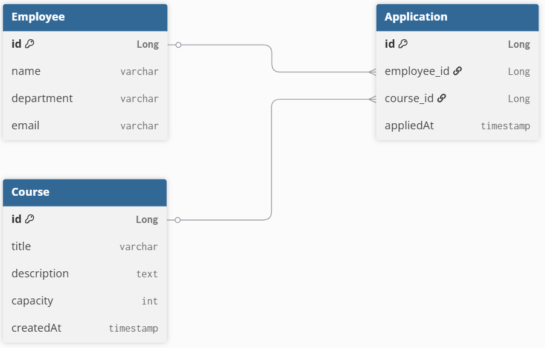

# 1. 패키지 구조

``` plain Text
Project
└── com.example.eduapp
    ├── domain
    │   ├── Employee.java
    │   ├── Course.java
    │   └── Application.java
    ├── repository
    │   ├── EmployeeRepository.java
    │   ├── CourseRepository.java
    │   └── ApplicationRepository.java
    ├── controller
    ├── service
    ├── dto
    │   ├── request
    │   └── response
    └── exception
```

# 2. ERD



# 3. API 테스트

## 직원 등록

### 요청

```java
POST /employees
```

### 응답

```json
{
  "status": 200,
  "msg": "성공",
  "data": {
    "name": "편준민",
    "department": "백엔드 개발자",
    "email": "lsaoe157@naver.com"
  }
}
```

### 실패(중복 방지)

```json
{
  "status": 400,
  "msg": "이미 사용 중인 이메일입니다.",
  "data": null
}
```

<br>

## 교육 등록

### 요청

```java
POST /courses
```

### 응답

```json
{
  "status": 200,
  "msg": "성공",
  "data": {
    "title": "Spring Boot 심화",
    "department": "Spring Boot의 심화 개념",
    "capacity": 1
  }
}
```

### 실패(중복 방지)

```json
{
  "status": 400,
  "msg": "이미 있는 교육입니다.",
  "data": null
}
```

## 교육 신청

### 요청

``` java
POST /applications
```

### 응답

```json
{
  "status": 200,
  "msg": "성공",
  "data": {
    "employeeId": 2,
    "courseId": 3
  }
}
```

### 실패(중복 방지)

```json
{
  "status": 400,
  "msg": "이미 신청한 과목입니다.",
  "data": null
}
```

## 과정별 신청자 목록 조회

### 요청

```java
GET /courses/{id}/applicants
```

### 응답

```json
{
  "status": 200,
  "msg": "성공",
  "data": [
    {
      "name": "ssar",
      "department": "백엔드 개발자",
      "appliedAt": "2025-07-14T19:34:19.150554"
    },
    {
      "name": "cos",
      "department": "프론트엔드 개발자",
      "appliedAt": "2025-07-14T19:34:19.150554"
    }
  ]
}
```

## 직원별 신청 내역 조회

### 요청

```java
GET /employees/{id}/applications
```

### 응답

```json
{
  "status": 200,
  "msg": "성공",
  "data": [
    {
      "title": "Spring Boot 입문",
      "appliedAt": "2025-07-14T19:34:19.150554"
    },
    {
      "title": "Spring Boot 심화",
      "appliedAt": "2025-07-14T19:34:40.32681"
    }
  ]
}
```


